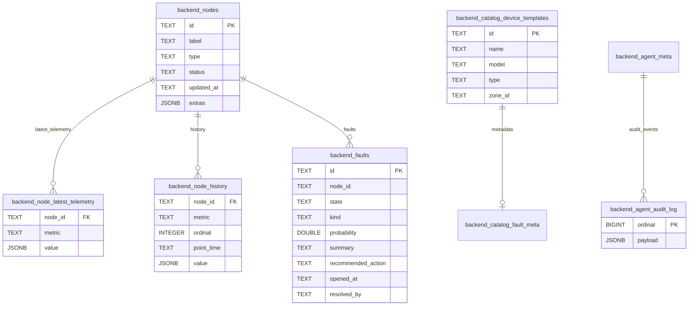

# Flox

> AI-native full-stack monorepo template for web apps, APIs, workers, ML pipelines, scrapers, and CLIs.

[](https://react.dev/)
[](https://www.typescriptlang.org/)
[](https://www.python.org/)
[](https://fastapi.tiangolo.com/)
[](https://www.docker.com/)
[](https://nx.dev)

Ultiplate is a production-oriented monorepo starter for building AI-enabled products quickly. It ships with a modern frontend, Python backends, background workers, ML workflows, Docker-based infrastructure, and shared utilities in one repo.

## Why Ultiplate

Most templates are either frontend-first or backend-only. Ultiplate is designed for projects that need both product code and operational code from day one:

- React + Vite frontend
- FastAPI or Flask backend
- Celery worker with Redis
- ML training and inference workflows
- Postgres and optional MongoDB
- Docker Compose profiles for local infrastructure
- Nx orchestration and caching
- Shared Python library for logging, scraping, and agent helpers

## Stack

### Frontend
- React 18
- TypeScript
- Vite
- Tailwind CSS
- Radix UI / shadcn-ui
- Bun

### Backend
- Python 3.12
- FastAPI
- Flask
- Celery
- uv

### Data and ML
- PostgreSQL
- Redis
- PyTorch
- scikit-learn
- XGBoost

### Infrastructure
- Docker Compose
- Nx
- Grafana
- Loki
- MinIO
- Anthropic / Claude integration

## Quick start

```bash
cp .env.example .env
make init
make dev
make up
````

Then open:

* Web app: `http://localhost:3000`

To inspect available commands:

```bash
make help
make doctor
```

## Features

* Monorepo structure for product, data, and infra code
* Switchable backend mode with FastAPI or Flask
* Optional background jobs with Celery + Redis
* Config-driven ML training and inference
* Shared internal Python package (`shacklib`)
* Structured logging to console and files
* Optional local observability stack with Loki + Grafana
* Optional object storage with MinIO
* Optional experiment tracking with MLflow
* Railway-ready frontend deployment setup
* Built-in support for agent workflows and Claude integrations

## Repository structure

```text
apps/
  webapp/             Vite + React + Tailwind + shadcn/ui
  webapp-minimal/     Streamlit prototype app
  backend/
    fastapi/          FastAPI backend
    flask/            Flask backend
  worker/             Celery worker, Redis broker

ml/
  configs/            YAML config for ETL and training
  models/             Model architecture and training loop
  data/               ETL code and processed artifacts
  inference.py        FastAPI inference server
  notebooks/          Jupyter notebooks

shacklib/             Shared Python utilities
src/                  Scripts and CLI entry points
database/             SQL init files
docker/               Service Dockerfiles
scripts/              Utility scripts
```

## Common commands

| Command            | Description                                             |
| ------------------ | ------------------------------------------------------- |
| `make init`        | First-time setup: virtualenv, dependencies, env linking |
| `make dev`         | Start the Vite frontend                                 |
| `make up`          | Start core Docker services                              |
| `make down`        | Stop Docker services                                    |
| `make run.backend` | Run backend using `BACKEND_MODE`                        |
| `make run.worker`  | Run Celery worker                                       |
| `make run.ml`      | Run ML inference server                                 |
| `make etl`         | Run ETL pipeline through Nx                             |
| `make train`       | Run training pipeline through Nx                        |
| `make fmt`         | Format Python with black                                |
| `make lint`        | Lint Python with ruff                                   |
| `make type`        | Type-check Python with mypy                             |
| `make test`        | Run tests                                               |
| `make clean`       | Remove build and cache artifacts                        |
| `make doctor`      | Verify local toolchain                                  |

## Optional services

Docker services are enabled through Compose profiles.

| Profile       | Services                                                     | Command                 |
| ------------- | ------------------------------------------------------------ | ----------------------- |
| default       | postgres, redis, backend-fastapi, backend-classifier, worker | `make up`               |
| `ml`          | ML inference                                                 | `make lift.ml`          |
| `sim`         | Node simulator                                               | `make lift.sim`         |
| `minio`       | MinIO object storage                                         | `make lift.minio`       |
| `tensorboard` | TensorBoard                                                  | `make lift.tensorboard` |
| `mlflow`      | MLflow tracking server                                       | `make lift.mlflow`      |
| `logging`     | Loki + Grafana                                               | `make lift.logging`     |
| `database`    | MongoDB                                                      | `make lift.database`    |

## Nx workspace

Ultiplate uses Nx to manage tasks across the monorepo.

```bash
bun x nx show projects
bun x nx graph
bun x nx run webapp:dev
bun x nx affected -t lint,test,build
```

Nx caches ETL and training outputs, so unchanged runs can be skipped automatically.

## ML workflow

Training is configuration-driven.

```text
ml/configs/data/default.yaml
ml/configs/train/default.yaml
```

Run the pipeline with:

```bash
bun x nx run ml:etl
bun x nx run ml:train
```

Inference is served through FastAPI and can be consumed by backend services or workers.

## AI integration

Set `ANTHROPIC_API_KEY` in `.env`.

`shacklib` exposes simple helpers for one-shot prompts, streaming, and multi-turn agents:

```python
from shacklib import ask, stream, Agent

result = ask("Summarize this sensor data: ...")

for chunk in stream("Write a Celery task that ..."):
    print(chunk, end="", flush=True)

agent = Agent(system="You are a senior Python developer.")
agent.chat("Scaffold a FastAPI endpoint for user profiles")
agent.chat("Add input validation and error handling")
```

For more advanced file and shell-based workflows:

```bash
uv add claude-agent-sdk
```

```python
from claude_agent_sdk import query, ClaudeAgentOptions

async for msg in query(
    prompt="...",
    options=ClaudeAgentOptions(allowed_tools=["Read", "Bash"]),
):
    print(msg)
```

### Claude Code commands

Inside a Claude Code session, the repo provides:

* `/plan`
* `/build`
* `/api`
* `/page`
* `/review`
* `/ship`

## Logging

`shacklib` includes structured JSON logging.

```python
from shacklib import get_logger

logger = get_logger("my-service")
logger.info("started", extra={"node_id": "BEL-VLV-003"})
```

To enable remote log shipping, set `LOKI_PORT` in `.env` and run:

```bash
make lift.logging
```

Grafana will then be available at:

```text
http://localhost:$GRAFANA_PORT
```

## Authentication

Authentication is off by default.

```env
VITE_REQUIRE_AUTH=false
```

To enable Supabase-based session auth:

```env
VITE_REQUIRE_AUTH=true
VITE_SUPABASE_URL=https://<project>.supabase.co
VITE_SUPABASE_ANON_KEY=<anon-key>
```

When enabled, all frontend routes are gated automatically.

## Dependency management

Python dependencies are managed with `uv` and `pyproject.toml`.

```bash
make deps
make lock
uv run pytest -v
```

Shared Python logic should live in `shacklib/` to avoid duplication across apps.

## Deployment

### Railway

The Vite frontend in `apps/webapp` can be deployed from the repo root using the provided `railway.json`.

If you set the Railway service root directory to `apps/webapp`, use:

```bash
bun install
bun run build
bun run start
```

Frontend environment variables must use the `VITE_` prefix.

## Database model

Application state is stored in normalized Postgres tables. A legacy JSONB snapshot in `backend_state` (`id = 1`) is also maintained for backward compatibility.

* `read_state()` reconstructs the original JSON contract
* `update_state()` writes both representations atomically



## Environment

Start by copying the example file:

```bash
cp .env.example .env
```

At minimum, set the project name and any API keys you need.

## Philosophy

Ultiplate is meant to be a practical starting point, not a framework you have to fight. It is optimized for teams that want:

* a real frontend and backend
* room for ML workloads
* background jobs
* local infrastructure
* clean task orchestration
* fast setup with sensible defaults

## License

Add your license here.

```

A few things that make this version feel more like popular repos:

- less badge noise and less sales language
- a tighter opening section with a clear value proposition
- “Why”, “Features”, “Quick start”, and “Common commands” near the top
- fewer deeply nested sections before the user can run it
- more skimmable structure for GitHub visitors

I can also give you a second version that is even closer to the style of repos like `create-t3-app`, `supabase`, or `langchain`.
```
