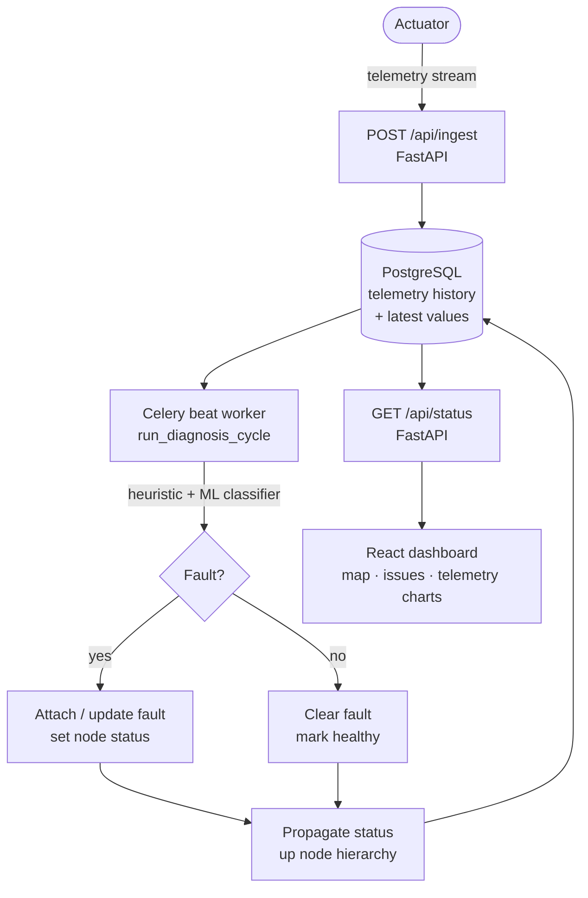
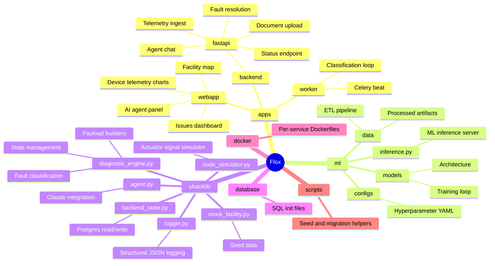
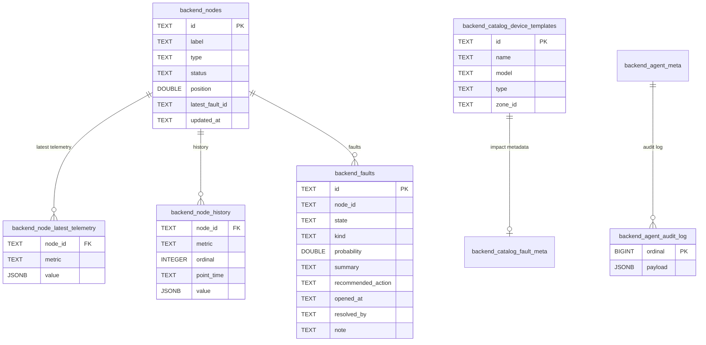
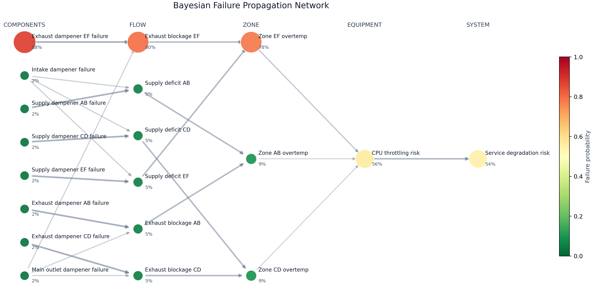

<h1><a href="https://starthack26-production.up.railway.app/">Flox</a></h1>


> **Real-time fault intelligence for [HVAC](https://www.britannica.com/technology/HVAC) actuators.** Flox ingests live telemetry from [Belimo](https://www.belimo.com/) actuators — torque, motor position, temperature, signal quality — runs continuous fault classification, and surfaces actionable insights through a facility dashboard and a conversational AI operations agent.


## What it does

Belimo actuators collect rich internal signals during operation — torque demand, motor position feedback, internal temperature, and control signal quality — but this data is rarely used beyond basic device status.

Flox closes that gap:

1. **Telemetry ingest** — actuator signals are ingested in real time and persisted with full history per variable per device.
2. **Fault classification** — a Celery worker runs a continuous diagnosis cycle. Heuristic rules detect known failure modes (stiction, high-torque anomaly, temperature drift, signal loss). An optional ML inference server extends this with trained classifiers.
3. **Fault propagation** — device-level faults roll up through the node hierarchy (actuator → AHU → plant), so system-level health reflects the worst downstream condition.
4. **Facility dashboard** — a live map view shows zone health, device positions, and active faults across the building. An issues panel lists all open faults ranked by severity, with energy waste and estimated cost impact per fault.
5. **Operations agent** — a Claude-powered agent answers natural-language questions about faults, runs diagnosis on demand, retrieves fault history, and can execute corrective actions with explicit operator approval before any write is committed.


## Fault types detected

| Kind                  | Severity |
| --------------------- | -------- |
| `stiction_suspected`  | Critical |
| `high_torque_anomaly` | Warning  |
| `temperature_drift`   | Warning  |
| `signal_loss`         | Critical |
| `weak_signal`         | Warning  |

ML-based classifiers (when enabled) extend coverage beyond rule thresholds.


## Quick start

```bash
cp .env.example .env      # set NAME, ANTHROPIC_API_KEY, and database credentials
make init                 # create venv, sync Python deps, link env files
make up                   # start postgres, redis, fastapi backend, classifier worker
make dev                  # start Vite frontend at http://localhost:3000
```

The frontend connects to the FastAPI backend at `/api/status`. If the backend is not running the dashboard will show a connection error.

```bash
make doctor               # verify toolchain
make help                 # list all targets
```


## Data pipeline




## Repository layout




## Operations agent

The agent is powered by Claude and has access to platform tools: querying live device status, fetching fault history for a specific node, running the diagnosis cycle, and resolving faults.

Destructive actions require explicit operator approval before execution. The frontend surfaces an approval prompt; the agent does not proceed until the operator confirms.

```python
# The agent is exposed at POST /api/agent/chat
# The frontend sends the full conversation history on each turn.
# Tool events are returned alongside the reply so the UI can display what ran.
```

To interact via the UI, open the **Operations Agent** panel and type a question. Use `@NODE_ID` to attach a specific device to your message. Quick prompts are generated automatically from the current top fault.

Example prompts:

- `Give me a live system overview and top active faults.`
- `Why is node BEL-VLV-003 reporting stiction_suspected?`
- `Show fault history for node BEL-AHU-001.`
- `Run diagnosis for BEL-VLV-003 now.`
- `Resolve fault fault-a3b2c1d0 with note "validated on site".`


## Environment variables

Copy `.env.example` to `.env` and fill in the values relevant to your deployment.

| Variable                      | Description                                   |
| ----------------------------- | --------------------------------------------- |
| `NAME`                        | Project name, used as Docker container prefix |
| `ANTHROPIC_API_KEY`           | Required for the operations agent             |
| `BACKEND_PORT`                | FastAPI listen port (default: 5000)           |
| `POSTGRES_*`                  | Database connection settings                  |
| `REDIS_PORT`                  | Redis port                                    |
| `ML_URL`                      | URL of the ML inference service               |
| `CLASSIFIER_INTERVAL_SECONDS` | How often the classifier runs (default: 5)    |
| `BACKEND_STARTUP_SEED_MODE`   | Seed mode on startup: `always` or `once`      |
| `VITE_REQUIRE_AUTH`           | Enable Supabase session auth on the frontend  |
| `LOKI_PORT` / `GRAFANA_PORT`  | Enable remote log aggregation                 |


## Make targets

| Target              | Description                                                        |
| ------------------- | ------------------------------------------------------------------ |
| `make init`         | First-time setup: venv, deps, env linking                          |
| `make dev`          | Start Vite frontend                                                |
| `make up`           | Start core services (postgres, redis, backend, classifier, worker) |
| `make down`         | Stop all services                                                  |
| `make run.backend`  | Start FastAPI backend only                                         |
| `make run.worker`   | Start Celery worker only                                           |
| `make run.ml`       | Start ML inference server                                          |
| `make lift.ml`      | Core services + ML inference                                       |
| `make lift.sim`     | Core services + node simulator                                     |
| `make lift.logging` | Add Loki + Grafana log stack                                       |
| `make lift.mlflow`  | Add MLflow experiment tracking                                     |
| `make etl`          | Run ETL pipeline                                                   |
| `make train`        | Run model training                                                 |
| `make fmt`          | Format Python with black                                           |
| `make lint`         | Lint with ruff                                                     |
| `make type`         | Type-check with mypy                                               |
| `make test`         | Run pytest                                                         |
| `make clean`        | Remove caches and build artifacts                                  |
| `make doctor`       | Verify toolchain (Python, uv, Bun, Docker)                         |


## Optional services

| Profile       | Services                                     | Command                 |
| ------------- | -------------------------------------------- | ----------------------- |
| _(default)_   | postgres, redis, backend, classifier, worker | `make up`               |
| `ml`          | + ML inference                               | `make lift.ml`          |
| `sim`         | + node simulator                             | `make lift.sim`         |
| `minio`       | + MinIO object storage                       | `make lift.minio`       |
| `tensorboard` | + TensorBoard                                | `make lift.tensorboard` |
| `mlflow`      | + MLflow                                     | `make lift.mlflow`      |
| `logging`     | + Loki + Grafana                             | `make lift.logging`     |
| `database`    | + MongoDB                                    | `make lift.database`    |


## Database schema

Application state is stored in normalized Postgres tables. A legacy JSONB snapshot in `backend_state` (`id = 1`) is maintained for backward compatibility. `read_state()` reconstructs the full JSON contract; `update_state()` writes both representations atomically.




## Bayesian network rendering (Python)


