# Ultiplate

Template for any project: SaaS webapp, API server, ML pipeline, scraper, CLI, or background worker. AI-native, platform-agnostic, managed via Makefile + Nx.

## Quick Start

```bash
cp .env.example .env        # fill in NAME and any keys you need
make init                   # uv venv + sync + env linking
make dev                    # Vite webapp at http://localhost:3000
make nx.projects            # list Nx projects in the monorepo
```

For Docker services (postgres, redis, fastapi backend, classifier worker, ml inference, worker):
```bash
make up
```

## Directory

```
apps/
  webapp/          Vite + React 18 + Tailwind + Supabase auth (Bun)
  webapp-minimal/  Streamlit quick prototype
  backend/
    fastapi/       FastAPI server (set BACKEND_MODE=fastapi)
    flask/         Flask server  (set BACKEND_MODE=flask)
  worker/          Celery background worker backed by Redis
ml/
  configs/         YAML config for data + training hyperparameters
  models/          arch.py (architecture) + train.py (training loop)
  data/            etl.py + processed artifacts
  inference.py     FastAPI inference server
  notebooks/       Jupyter notebooks
shacklib/          Shared Python utilities (logger, scraper, agent)
src/               Simple scripts / CLI entry points
```

## Make Targets

| Target | Description |
|--------|-------------|
| `make init` | First-time setup |
| `make dev` | Start Vite webapp |
| `make up` | Start Docker core services |
| `make run.backend` | Start API backend |
| `make run.worker` | Start Celery worker |
| `make nx.graph` | Open Nx project graph |
| `make nx.affected` | Run lint/test/build for affected projects |
| `make lift.minio` | Start MinIO object storage |
| `make lift.logging` | Start Loki + Grafana |
| `make lift.mlflow` | Start optional MLflow server |
| `make lift.database` | Start Postgres / MongoDB |
| `make doctor` | Verify toolchain |

Run `make help` for the full list.

## Nx Workspace

This template now ships with Nx project definitions for:

- `webapp` (`apps/webapp`)
- `webapp-minimal` (`apps/webapp-minimal`)
- `backend-fastapi` (`apps/backend/fastapi`)
- `backend-flask` (`apps/backend/flask`)
- `worker` (`apps/worker`)
- `ml` (`ml`)
- `shacklib` (`shacklib`)

Common commands:

```bash
bun x nx show projects
bun x nx graph
bun x nx run webapp:dev
bun x nx affected -t lint,test,build
```

## Railway Deploy

The frontend in `apps/webapp` is a Vite React app. If you deploy from the repo root on Railway, use `railway.json` so Railpack builds and starts the correct app:

- build: `bun install --cwd apps/webapp && bun run --cwd apps/webapp build`
- start: `bun run --cwd apps/webapp start`

If you instead set the Railway service Root Directory to `apps/webapp`, the equivalent commands are:

```bash
bun install
bun run build
bun run start
```

Frontend environment variables must use the `VITE_` prefix.

## AI Agent Capacity

Set `ANTHROPIC_API_KEY` in `.env`. Then use:

```python
from shacklib import ask, stream, Agent

# One-shot
print(ask("Summarize this data: ..."))

# Streaming
for chunk in stream("Write a Celery task that ..."):
    print(chunk, end="", flush=True)

# Multi-turn
agent = Agent(system="You are a senior Python developer.")
agent.chat("Scaffold a FastAPI endpoint for user profiles")
agent.chat("Add input validation and error handling")
```

Claude Code slash commands (type `/` in a Claude Code session):
- `/plan` - implementation plan for an idea within this boilerplate
- `/build` - implement a feature end-to-end
- `/api` - scaffold a new backend endpoint
- `/page` - scaffold a new webapp page
- `/review` - code review of recent changes
- `/ship` - stage and commit changes

## Logging

```python
from shacklib import get_logger
logger = get_logger("service")
```

Outputs structured JSON to console + `./logs/`. Optional Loki push when `LOKI_PORT` is set and `make lift.logging` is running. View in Grafana at `http://localhost:$GRAFANA_PORT` (add Loki data source: `http://loki:3100`).

## Python Packaging

Python dependencies are managed with `pyproject.toml` and `uv`.

```bash
make deps         # uv sync
make lock         # refresh uv.lock
uv run pytest -v
```

## ML Workflow

High-level ML hyperparameters live in YAML configs:

- `ml/configs/data/default.yaml`
- `ml/configs/train/default.yaml`

Run with Nx targets (cacheable with explicit inputs/outputs):

```bash
bun x nx run ml:etl
bun x nx run ml:train
```

`ml:train` depends on `ml:etl`, and both targets cache artifacts in `ml/data/processed`, `ml/models/weights`, and `ml/tensorboard`.

## Services (docker compose profiles)

| Profile | Services | Command |
|---------|----------|---------|
| _(default)_ | postgres, redis, backend-fastapi, backend-classifier, ml-inference, worker | `make up` |
| `minio` | + MinIO object storage | `make lift.minio` |
| `tensorboard` | + TensorBoard | `make lift.tensorboard` |
| `mlflow` | + MLflow tracking server (optional) | `make lift.mlflow` |
| `logging` | + Loki + Grafana | `make lift.logging` |
| `database` | + Postgres + MongoDB | `make lift.database` |

## Webapp Auth

Auth is off by default (`VITE_REQUIRE_AUTH=false`). Set it to `true` and configure the Vite-prefixed Supabase env vars to enable session-based auth gating across all routes.

## Backend State Schema (Postgres)

The backend state storage is now normalized into relational tables while preserving full backward compatibility through a legacy snapshot row in `backend_state` (`id = 1`).

```mermaid
erDiagram
    backend_state {
        SMALLINT id PK
        JSONB state
        TIMESTAMPTZ updated_at
    }

    backend_storage_meta {
        SMALLINT id PK
        BOOLEAN bootstrapped
        TIMESTAMPTZ updated_at
    }

    backend_state_top_level {
        SMALLINT id PK
        JSONB payload
    }

    backend_state_meta {
        SMALLINT id PK
        TEXT last_ingest_at
        TEXT last_classification_at
        TEXT last_fault_resolution_at
        TEXT seed_source
        TEXT seeded_at
        JSONB extras
    }

    backend_catalog_meta {
        SMALLINT id PK
        JSONB extras
    }

    backend_agent_meta {
        SMALLINT id PK
        JSONB extras
    }

    backend_nodes {
        TEXT id PK
        TEXT label
        TEXT type
        TEXT status
        DOUBLE position
        TEXT updated_at
        TEXT latest_fault_id
        TEXT latest_telemetry_at
        JSONB extras
    }

    backend_node_parents {
        TEXT node_id FK
        INTEGER ordinal
        TEXT parent_id
    }

    backend_node_latest_telemetry {
        TEXT node_id FK
        TEXT metric
        JSONB value
    }

    backend_node_history {
        TEXT node_id FK
        TEXT metric
        INTEGER ordinal
        TEXT point_time
        JSONB value
        JSONB extras
    }

    backend_faults {
        TEXT id PK
        TEXT node_id
        TEXT state
        TEXT kind
        DOUBLE probability
        TEXT summary
        TEXT recommended_action
        TEXT opened_at
        TEXT updated_at
        TEXT resolved_by
        TEXT note
        JSONB extras
    }

    backend_catalog_zones {
        TEXT id PK
        INTEGER ordinal
        TEXT name
        TEXT label
        INTEGER x
        INTEGER y
        INTEGER width
        INTEGER height
        INTEGER health_score
        JSONB extras
    }

    backend_catalog_ahu_units {
        TEXT id PK
        INTEGER ordinal
        TEXT label
        INTEGER x
        INTEGER y
        TEXT description
        JSONB extras
    }

    backend_catalog_device_templates {
        TEXT id PK
        INTEGER ordinal
        TEXT name
        TEXT model
        TEXT serial
        TEXT type
        TEXT zone
        TEXT zone_id
        INTEGER x
        INTEGER y
        TEXT installed_date
        DOUBLE base_anomaly_score
        TEXT airflow_direction
        JSONB extras
    }

    backend_catalog_template_history {
        TEXT template_id FK
        TEXT metric
        INTEGER ordinal
        TEXT point_time
        JSONB value
        JSONB extras
    }

    backend_catalog_fault_meta {
        TEXT device_id PK
        TEXT estimated_impact
        TEXT energy_waste
        JSONB extras
    }

    backend_agent_pending_actions {
        TEXT action_id PK
        JSONB payload
    }

    backend_agent_audit_log {
        BIGINT ordinal PK
        JSONB payload
    }

    backend_nodes ||--o{ backend_node_parents : "parent links"
    backend_nodes ||--o{ backend_node_latest_telemetry : "latest telemetry"
    backend_nodes ||--o{ backend_node_history : "history points"
    backend_nodes ||--o{ backend_faults : "fault timeline"

    backend_catalog_device_templates ||--o{ backend_catalog_template_history : "template history"
    backend_catalog_device_templates ||--o| backend_catalog_fault_meta : "impact metadata"

    backend_agent_meta ||--o{ backend_agent_pending_actions : "pending actions"
    backend_agent_meta ||--o{ backend_agent_audit_log : "audit events"
```



Compatibility notes:
- `read_state()` reconstructs the original JSON contract from relational tables.
- `update_state()` writes both relational tables and the legacy `backend_state.state` JSONB snapshot.
- Existing API/worker/webapp consumers continue using the same state shape.
